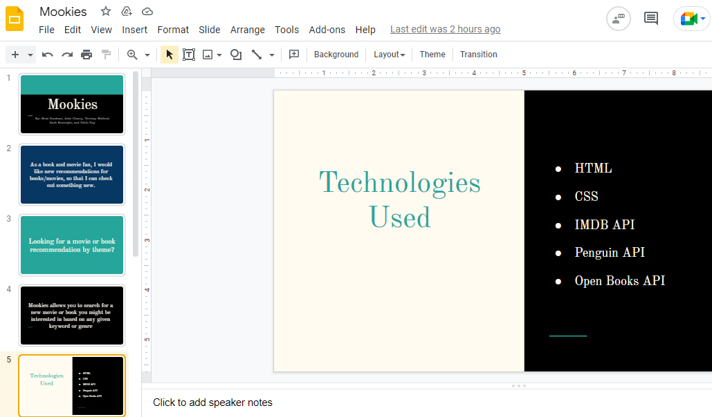
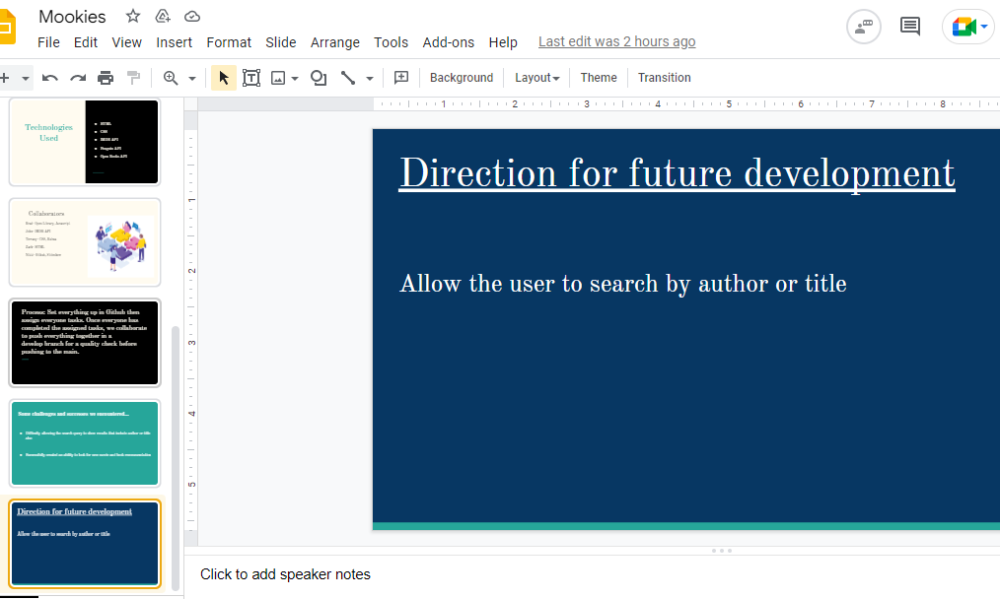
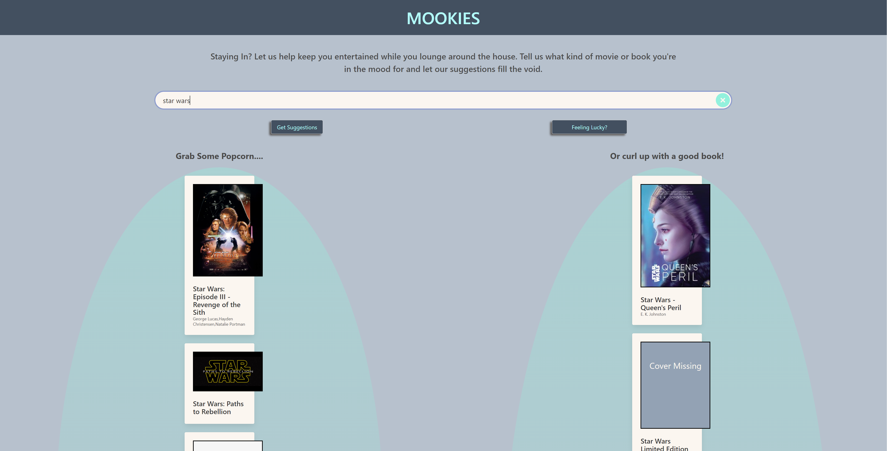

# project1
Our first group project

## User Story

As a couch potato with nothing to do 
I WANT to fill my waking hours with watching movies or getting lost in books 
SO THAT I can keep myself entertained while exerting as little effort as possible. 😆
 

## Assets

The following image shows a basic wireframe depiciton of the web application's appearance:

## Criteria

* GIVEN a web application that takes user input and returns movie and book suggestions
* WHEN I enter a genre into the search bar and press 'Get Suggestions'
* THEN I am presented with a list of movie suggestions on the left hand side of the page and book suggestions on the right hand side based on my input
* WHEN I enter a book or movie title 
* THEN I am presented with a list of movies on the left and books on the right that match that title
* WHEN the title doesn't match up with anything I am presented with a list of titles witin that genre (maybe?)
* WHEN I press the 'Feeling Lucky?' button
* THEN I am presented with a list of movies on the left and books on the right based off a randomly generated genre
* WHEN I select a specific movie or book out of either of the lists
* THEN I am preseneted with a modal of the selected title with info,links to purchase, list of where to stream, and maybe a link to the corresponding movie or book of the same title (if any)

## Technologies We Used:
* HTML
* CSS
* JavaScript
* IMDB API
* Open Library API

## Presentation

## Final Product

* https://bdunham484.github.io/project1/

## Contribution:

Made with ❤️ by The Mookies:
- Nikki Nay
- Terrany Binford
- Zach Boatright
- John Clancy
- Brad Dunham
